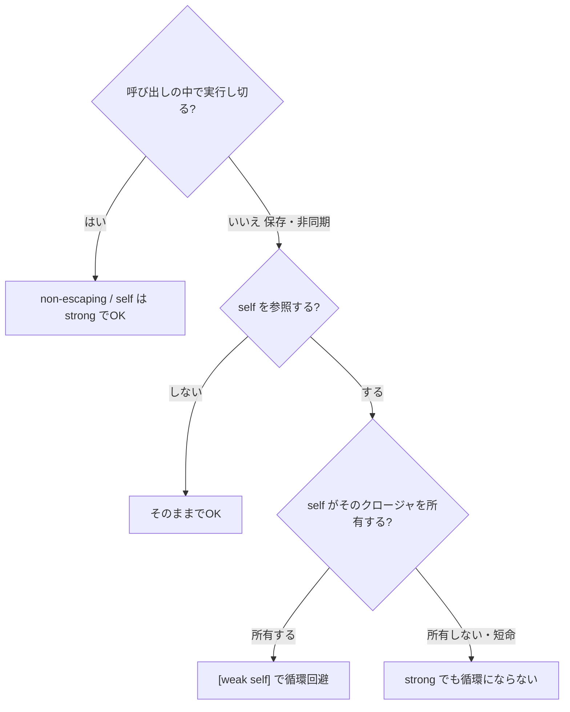

クロージャまわりで迷いやすい **「変数捕捉 / 値捕捉」「`@escaping`」「`[weak self]`」** の3軸を、実務で判断できる形に整理します。最後に判断フローと、動くコードでの検証結果を載せます。

## 結論（3軸）

| 軸 | 既定 | 切り替えるのは |
|---|---|---|
| 何を捕まえるか | **変数**を捕捉（後の変更が見える） | 生成時点で固定したい → `[x]` で**値**捕捉 |
| いつ実行されるか | **non-escaping**（呼び出し内で完結） | 保存/後で/非同期 → `@escaping` |
| self をどう持つか | **strong**（強参照） | 循環になる → `[weak self]` |

## 軸1: 変数捕捉 vs 値捕捉

クロージャは既定で **変数そのもの** を捕まえるため、生成後の変更が見えます。`[x]`（キャプチャリスト）を書くと **生成時点の値** を固定します。

```swift
var x = 1
let byRef = { x }          // 変数を捕捉
let byVal = { [x] in x }   // 生成時点の値を捕捉
x = 2
byRef()  // → 2  （後の変更が見える）
byVal()  // → 1  （作った瞬間で固定）
```

- 最新値・共有状態を読みたい → **変数捕捉（既定）**
- ループ変数や一時値を「今の値」で固めたい → **値捕捉 `[x]`**

## 軸2: non-escaping vs @escaping

```swift
// non-escaping（既定）: 呼び出しの中で実行し切る。保存しないので循環を作れない
func each(_ f: () -> Void) { f() }
[1, 2, 3].forEach { print($0) }

// @escaping: 呼び出しより長生きする（保存 / 非同期 / completion / Task）
func load(_ done: @escaping (Data) -> Void) { /* あとで done(...) */ }
var handler: (() -> Void)?   // 保存も escaping
```

:::message alert
**よくある誤解**：`@escaping` は「メモリリークを防ぐ」ものではありません。むしろ**逆**で、escaping はクロージャが長生きする印。**リークが起きうるのはこちら側**なので、self の持ち方（軸3）を考える必要があります。
:::

## 軸3: self は strong / weak / unowned のどれか

self が escaping クロージャを保存し、そのクロージャが self を強参照すると、相互に手放せず解放されません（循環参照）。

```swift
final class ViewModel {
    var onChange: (() -> Void)?
    init() {
        onChange = { self.update() }        // ❌ self ⇄ closure の循環
    }
    func update() {}
}
```

```swift
init() {
    onChange = { [weak self] in
        self?.update()                      // ✅ 循環を断つ
    }
}
```

| 持ち方 | いつ使う | 注意 |
|---|---|---|
| **strong**（既定） | non-escaping、または self がそのクロージャを所有しない escaping | 循環にならないなら最も素直 |
| **`[weak self]`** | self が（間接含め）その escaping クロージャを所有する時 | self は Optional に。使う時は `guard let self` |
| **`[unowned self]`** | self が必ずクロージャより長生きすると保証でき、非Optionalで書きたい時 | 保証が崩れると**クラッシュ**。迷ったら weak |

## 実務の判断フロー



## 検証

この挙動は最小の Swift Package（Swift 6 言語モード）で確認しています。

- `strong` 捕捉 → スコープを抜けても解放されない（`weak var` が非nilのまま＝リーク）
- `[weak self]` → スコープを抜けたら解放（`weak var` が nil）
- 変数捕捉 = 2 / 値捕捉 = 1

```swift
func testStrongSelfCaptureLeaks() {
    weak var ref: LeakyCounter?
    do { let c = LeakyCounter(); ref = c }
    XCTAssertNotNil(ref)   // 循環で生き残る
}
func testWeakSelfCaptureDeallocates() {
    weak var ref: SafeCounter?
    do { let c = SafeCounter(); ref = c }
    XCTAssertNil(ref)      // 正しく解放
}
```

## まとめ

- 捕捉は既定で**変数**、固定したいなら `[x]`。
- `@escaping` は「長生きする印」。リーク防止ではない。
- escaping で **self が所有する**なら `[weak self]`。それ以外は strong で素直に。

判断に迷ったら「呼び出し内で終わる？ → self を参照？ → self が所有？」の順で辿れば、`[weak self]` を入れるべき場面が一意に決まります。
