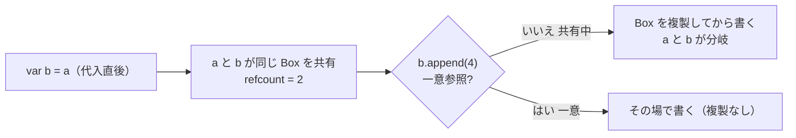

「値型なのに、なぜコピーのコストを気にせず配れるのか」。その裏側にある **`mutating`** と **copy-on-write（CoW）** を、最小の自作CoW型で確認します。最後に **実務で自作CoWを書くのはどんな時か** までまとめます。

## `mutating` は「self を書き換える」宣言

struct の**通常のインスタンスメソッドの中では `self` は定数（`let`）扱い**です。プロパティを書き換えるメソッドには `mutating` が要ります。`mutating` を付けると self が可変（`inout` 的）になります。

```swift
struct Point {
    var x: Int
    mutating func moveRight() { x += 1 }   // mutating が無いとコンパイルエラー
}

var p = Point(x: 1)
p.moveRight()   // p.x == 2

let q = Point(x: 1)
// q.moveRight()  // ❌ let で束縛したインスタンスは丸ごと不変 → 呼べない
```

`let` に対して呼べないのは「値そのものが不変」だから。**不変性を型で守っている**わけです。

## 値型はコピーされる、だが毎回だと重い

`var b = a` で **独立したコピー**ができます（値セマンティクス）。片方を変えても他方に影響しません。
ただし中身が大きい配列などで**代入のたびに全複製**していたら、メモリもCPU（コピー時間）も無駄。そこで **copy-on-write**。

## copy-on-write の仕組み

中身を **class のストレージ箱**に持たせ、コピー時は**箱への参照だけ**を共有します。そして**書き込む瞬間**に「今この箱を参照しているのは自分だけか？」を `isKnownUniquelyReferenced` で判定し、**共有中なら複製してから**書きます。

```swift
final class Box<T> { var value: T; init(_ v: T) { value = v } }

struct CoWBuffer {
    private var box: Box<[Int]>
    init(_ elements: [Int] = []) { box = Box(elements) }
    var elements: [Int] { box.value }

    mutating func append(_ x: Int) {
        if !isKnownUniquelyReferenced(&box) {
            box = Box(box.value)   // 共有中だった → 複製（copy-on-write）
        }
        box.value.append(x)        // 自分だけの箱に書き込む
    }
}
```

- `isKnownUniquelyReferenced(&box)` … **その class インスタンスを参照しているのが自分1つ（一意）か**を判定。
- 一意なら**複製せずその場で変更**。共有中なら**複製してから変更**。



:::message
`isKnownUniquelyReferenced` は **ネイティブな Swift class の参照**にのみ使えます（`@objc`/NSObject 由来には不可）。CoW の箱は素朴な `final class` を使います。
:::

## 標準ライブラリはすでに CoW

`Array` / `Dictionary` / `Set` / `String` は**最初から CoW**。だから値型なのに代入が軽く、書き込み時だけコピーされます。普段は意識せず値セマンティクスの恩恵を受けています。

## 実務で「自作CoW」を書くのはどんな時か

一言でいうと **「コピーが高価な“重い中身”を持つ値型を、値セマンティクスのまま安く配りたい時」**。

| ケース | なぜ CoW |
|---|---|
| 大きなバッファを包む値型 | 画像ビットマップ / 音声PCM / 大きな `Data` / 行列・メッシュ。代入のたびの全コピーを避ける |
| Obj-C/C の可変参照型を値型でラップ | `NSMutableData` / `NSMutableAttributedString` / `CGMutablePath` 等。struct で包み、書込時だけ複製して**値セマンティクスを付与** |
| 自作コレクション / データ構造 | 独自の配列・ツリー等。値型として振る舞わせつつ内部ストレージは共有 |
| パフォーマンス重要ドメイン | 画像処理・オーディオ・ゲーム・数値計算。防御的コピーを避けたい |

逆に、`Int`/`String` 数個の小さな struct には **不要**（箱のアロケーション分むしろ損）。標準の値型で十分です。

## 検証

最小の Swift Package（Swift 6 言語モード）でテスト済み。

```swift
func testCopyOnWriteBranchesOnMutation() {
    var a = CoWBuffer([1, 2, 3])
    var b = a
    XCTAssertEqual(a.storageID, b.storageID)     // 代入直後は共有（ID一致）
    b.append(4)
    XCTAssertNotEqual(a.storageID, b.storageID)   // 書込で分岐（ID不一致）
    XCTAssertEqual(a.elements, [1, 2, 3])         // a は不変
    XCTAssertEqual(b.elements, [1, 2, 3, 4])
}
```

（`storageID` は `ObjectIdentifier(box)` を返す確認用プロパティ）

## まとめ

- `mutating`：struct のメソッドで self を変えるための宣言。`let` には効かず不変を守る。
- 値型は代入でコピー。ただし **CoW** で「**共有中に書き込む時だけ**複製」。
- 判定は `isKnownUniquelyReferenced`：**一意なら複製せず、共有中なら複製してから書く**。
- 標準ライブラリは CoW 済み。**自作するのは「重い中身を持つ値型を値セマンティクスのまま安く配りたい時」**。
